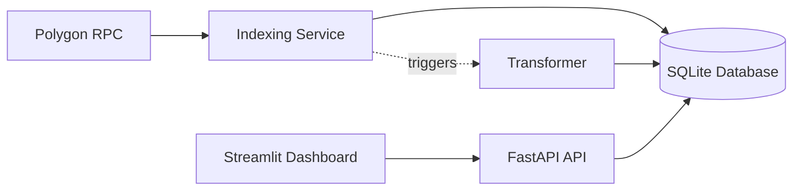

# 📊 Real-Time Polygon Blockchain Data Indexer

## 📌 Introduction

This project implements a **real-time blockchain data indexing system** on the **Polygon network**.
The system focuses on the **POL token** and calculates **cumulative net-flows to the Binance exchange**.

It listens for new blocks in real time, extracts token transfers, stores them in a database, transforms raw data into aggregated metrics, and exposes results through an API and UI dashboard.

---

## 🎯 Key Metrics

* **Cumulative Net-Flows to Binance** =
  (Sum of POL tokens sent **to** Binance addresses) – (Sum of POL tokens sent **from** Binance addresses)

---

## ✅ Deliverables Mapping

1. **Schema Design & Implementation**

   * Implemented in `app/db.py` using **SQLite + SQLAlchemy**.
   * Tables:

     * `transactions` → stores raw transfer data
     * `net_flows` → stores cumulative inflow, outflow, and net flow

2. **Indexing Logic**

   * Implemented in `app/indexer.py` using **web3.py**.
   * Connects to Polygon RPC, listens for new blocks, extracts `Transfer` events, and inserts them into the database.

3. **Data Transformation Flow**

   * Implemented in `app/transformer.py`.
   * Processes raw transactions into **cumulative net-flows for Binance**.

4. **Query Mechanism**

   * Implemented in `app/api.py` using **FastAPI**.
   * Exposes `/netflow` endpoint returning JSON metrics.
   * Example response:

     ```json
     {
       "exchange": "Binance",
       "cumulative_inflow": 12345.67,
       "cumulative_outflow": 8901.23,
       "net_flow": 3444.44,
       "last_updated": "2025-09-05T12:00:00"
     }
     ```

5. **Scalability Strategy**

   * Architecture supports extension by:

     * Adding more exchanges (new address lists)
     * Adding more tokens (update token config)
     * Switching DB to Postgres/MySQL for production

6. **No Backfill**

   * System only indexes **from the point of deployment forward**.
   * Historical backfill is explicitly excluded (per requirements).

7. **Presentation**

   * Implemented in `ui/dashboard.py` using **Streamlit**.
   * Displays inflows, outflows, and net flows with real-time updates.

---

## 🏗️ System Architecture




---

## 📂 Project Structure

```
polygon-indexer/
│── app/
│   ├── api.py          # FastAPI endpoints (/ and /netflow)
│   ├── db.py           # SQLite schema and connection
│   ├── indexer.py      # Real-time blockchain indexer
│   ├── transformer.py  # Net flow calculator
│── ui/
│   ├── dashboard.py    # Streamlit dashboard UI
│── requirements.txt    # Python dependencies
│── README.md           # Documentation
│── .gitignore
```

---

## ⚡ Quickstart

### 1. Clone Repository

```bash
git clone <your-repo-url>
cd polygon-indexer
```

### 2. Setup Environment

```bash
python -m venv venv
venv\Scripts\activate   # Windows
# or
source venv/bin/activate   # Linux/Mac

pip install -r requirements.txt
```

### 3. Run Backend API

```bash
uvicorn app.api:app --reload
```

API available at: [http://127.0.0.1:8000](http://127.0.0.1:8000)

### 4. Run Indexer

```bash
python -m app.indexer
```

This will start listening to Polygon blocks and writing POL transfers into `polygon_indexer.db`.

### 5. Run Dashboard

```bash
streamlit run ui/dashboard.py
```

Dashboard available at: [http://localhost:8501](http://localhost:8501)

---

## 🔧 Configuration

* **Polygon RPC**: defaults to `https://polygon-rpc.com` (can be replaced with Infura/Alchemy).
* **Token**: POL (`0x0000000000000000000000000000000000001010`).
* **Exchanges**: Binance hot wallets configured in `transformer.py`.

---


## 📚 References

* [Polygon Docs](https://polygon.technology/)
* [Web3.py Docs](https://web3py.readthedocs.io/)
* [FastAPI Docs](https://fastapi.tiangolo.com/)
* [Streamlit Docs](https://docs.streamlit.io/)
